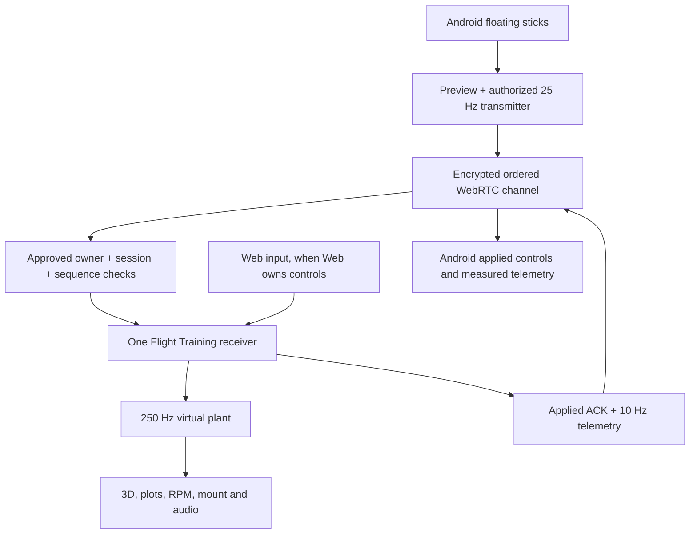
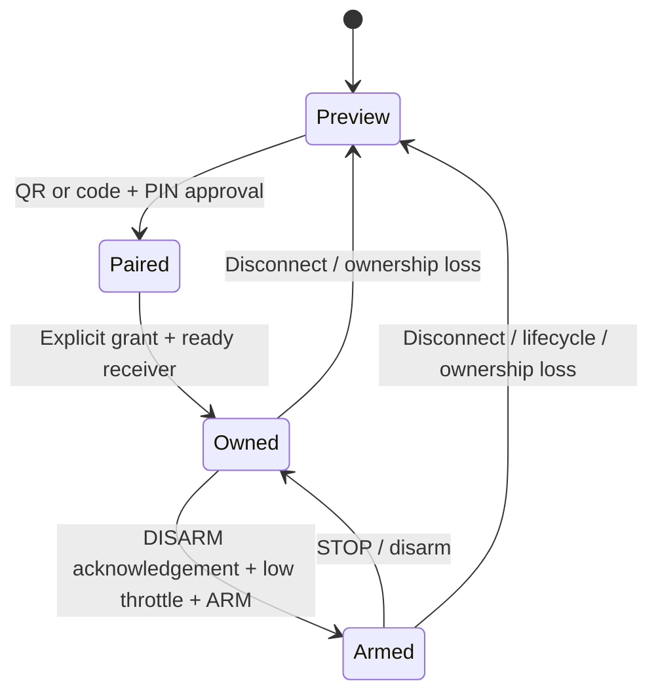

# One receiver, one virtual plant

The WebRTC host and renderer share `window.ZebjusTraining` in `/tripod.html`. Opening the connection dialog does not create another renderer or peer. Navigation tears down the peer, camera, RAF, Three.js geometry/material/texture resources and audio; return requires fresh pairing and explicit ARM.

Pairing retains version-1 compressed/expiring QR offer/answer exchange, the safety PIN and explicit Web confirmation. Optional six-digit code signaling retains its authenticated PeerJS path; it requires Internet and is not a new drone transport. The ordered DataChannel is `zebjus-flight-v1`; no TURN relay or connectivity guarantee is implied. QR/codes authenticate exchange and approval; a display field or packet cannot assign ownership.

| Frame / gate | Behavior |
|---|---|
| `SIM_CONTROL` | `seq`, current `sessionId`, `mode: angle|acro`, boolean `armed`, integer throttle 1000–2000 and finite normalized roll/pitch/yaw; optional radially bounded raw sticks are only for mirroring |
| Receiver authorization | Approved live peer, mobile ownership, simulator ready, current session and increasing sequence. First new grant requires DISARM then fresh explicit ARM at ≤1050. Local Web Run requires 1000 (physics guard ≤1025). |
| `SIM_ACK` | Produced only after actual receiver application. Contains `ackSeq`, `accepted` and actual applied state; failures never pretend to be applied. Old/session-mismatched/unknown-sent ACKs cannot change controls. |
| `SIM_TELEMETRY` | Same-session measured angles/rates, motor command/requested+actual RPM/thrust and vertical state at 10 Hz. Queued telemetry older than the owned ACK/ARM watermark is ignored. Web-owned state is visibly labeled separately from local Android preview. |
| `SIM_STOP` | Immediately stops the single virtual plant and tells Android to neutral/disarm. STOP is present on both main controls and connection sheets. |
| Watchdogs | Receiver stops after 450 ms without applied controls; Android stops after 650 ms without valid receiver feedback. Reconnect/ownership loss never auto-arms. |
| Queue bounds | Normal controls/telemetry at 32 KiB; critical control ceiling 128 KiB. Frames are refused instead of accumulating an application queue. A full queue leads to watchdog STOP. |

Pointer-down captures its own zone at the real touch coordinates and sets zero displacement. Pointer movement uses radial clamping, deadband and expo. Roll/pitch/yaw recenter independently on release; armed throttle integrates elapsed time and holds the last accepted integer. Preview never integrates a flight throttle. Existing reversed yaw means left-stick right → negative yaw on Android and Web; the receiver does not invert it again.

SVG concept references are in `diagrams/`. They are marked as supplied concepts; actual screen evidence comes from the browser/native artifacts listed in RELEASE_EVIDENCE.
