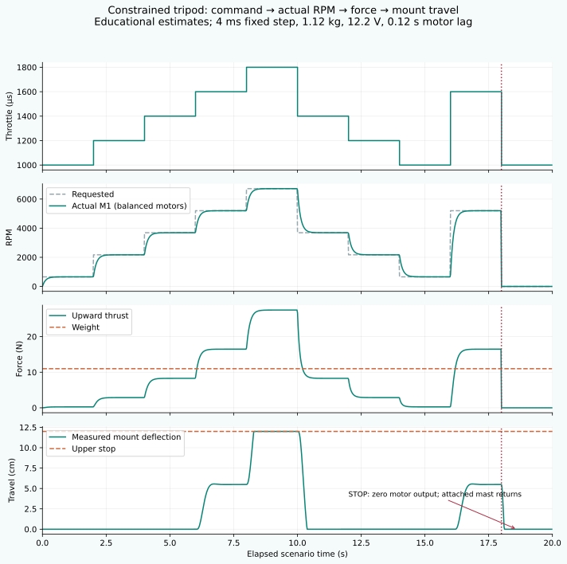
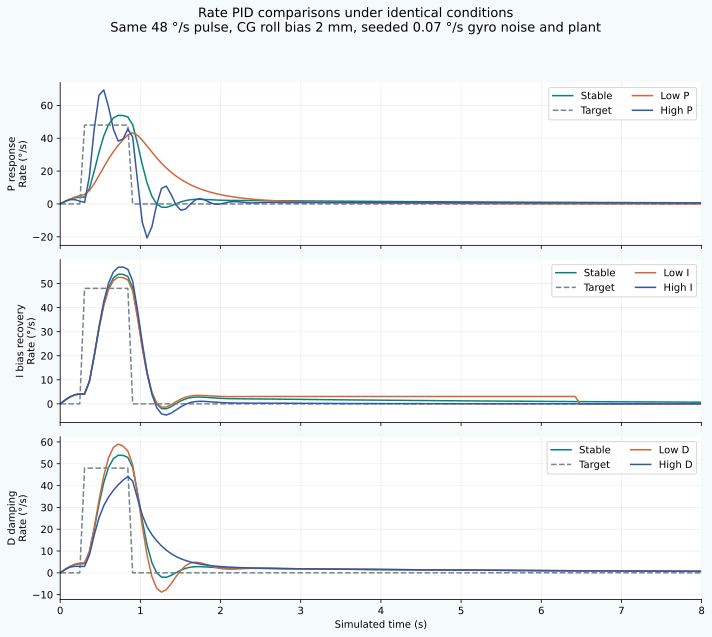
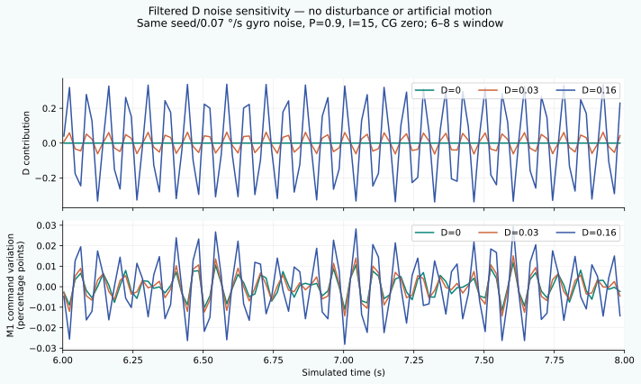

# Quantitative educational plant

All coefficients below are **educational estimates**, not measured F450 thrust, flight calibration or real-drone PID advice. The model is a gimbaled constrained teaching rig, not free flight or altitude hold. Physics advances in 4 ms steps; render/UI/audio consume its measured state.

| Parameter | Value / unit |
|---|---|
| Frame mass / gravity | 1.12 kg / 9.81 m/s²; payload adds 0–0.8 kg |
| Maximum shaft speed / armed command floor | 8500 RPM / 8%; DISARM/STOP sets all outputs to zero |
| Thrust coefficient `kT` | 1.3883456305×10⁻⁵ N/(rad/s)²; one motor gives 11 N at 8500 RPM |
| Reactive torque coefficient `kQ` | 2.7766912611×10⁻⁷ N·m/(rad/s)²; `Q/F=0.020 m` |
| Motor time constant | 0.12 s default; slider 0.04–0.30 s |
| Mount spring / damper / limits | 100 N/m / 14 N·s/m / 0–0.12 m |
| X-frame motor coordinates | `(x,z)`: M1(-.325,+.325), M2(+.325,+.325), M3(+.325,-.325), M4(-.325,-.325), meters |
| Spin signs / axes | +1,-1,+1,-1; world Y up, nose +Z, X pitch, Y yaw, Z roll |
| Inertias / payload scaling | Pitch .045, yaw .085, roll .048 kg·m², increased by the documented payload factors in source |
| Roll/pitch mechanical travel | ±45°; yaw wraps continuously |
| Gyro | 20 ms low-pass; deterministic sinusoidal noise, .07 °/s default, seed 7919; noise slider 0–1 °/s |

For each motor, base command `b = 100*(0.08 + 0.92*(throttle-1000)/1000)`. Mixer commands are `[b-r-p-y, b+r-p+y, b+r+p-y, b-r+p+y]`, bounded 8–100 while armed. Battery scales requested speed by `clamp(V/12.6,.65,1)`. Actual speed follows the exact constant-target update:

`ω ← ω + (ω_request − ω)*(1 − exp(−.004/τ))`, `RPM=30ω/π`, `F=kTω²`.

Actual force, RPM and requested command remain separate in the UI. Doubling actual shaft speed quadruples force below bounds. Torque uses `Σ(r×F)` and reaction opposite propeller spin; body acceleration uses diagonal inertia, gyroscopic cross coupling and viscous damping. CG offsets create weight torque; wind creates deterministic bounded torque. Exact YXZ body-rate→Euler kinematics update the assembly attitude. No preset directly animates a tilt.

Vertical force is `F_up=ΣF_i*max(0,cos(roll)cos(pitch))`, weight `W=mg`, and free slider acceleration `(F_up−W−100z−14v)/m`. Semi-implicit velocity/position integration projects contact at 0 / 12 cm and removes outward velocity. The support balances forbidden travel; STOP zeros motor force immediately and the attached mast settles under gravity/spring/damping. The numerical gauge is centimeters; rendering converts 3.5 scene units/m and magnifies travel **2×**, so pivot Y is `3.48 + 7z`. This magnification does not alter any numerical trace.

| Balanced throttle at 12.2 V after 2 s | Actual RPM / motor | Total upward N | Mount cm |
|---|---:|---:|---:|
| 1000, armed idle | 658.4 | 0.264 | 0, bottom support |
| 1200 | 2172.8 | 2.875 | 0 |
| 1400 | 3687.1 | 8.279 | 0 |
| 1600 | 5201.5 | 16.477 | 5.489 |
| 1800 | 6715.8 | 27.467 | 12, upper stop |
| STOP | 0 | 0 | Damped return to 0 |

## Rate and Angle control

Pure ACRO uses stick×220 °/s for roll/pitch; center requests exactly zero rate without attitude hold. ANGLE uses trim+stick×26° as the outer target; outer PID generates a bounded ±220 °/s target for the inner Rate PID. Yaw always uses stick×180 °/s Rate PID and preserves the reversed input sign. There is no yaw heading PID.

Rate banks default to P=.9/I=15/D=.03 for roll/pitch and P=3/I=15/D=0 for yaw. ANGLE has its own inner banks and outer Roll/Pitch P=3/I=0/D=0. P acts on degree/degree-per-second error; rate integral contribution is `I_gain*I_state*.012`, angle integral is unscaled. D is negative filtered measurement derivative (32 ms inner / 100 ms outer), avoiding setpoint derivative kick. Outer output bounds ±220; inner bounds ±450. Mixer scaling is .052 roll/pitch and .035 yaw. Conditional antiwindup uses controller bounds and clipped-mixer residual. Mechanical stops are explicitly detected in experiment results; a forced zero rate at a stop is **not** reported as controller settling.

Live Apply queues gain changes to the next 4-ms boundary. Where possible it adapts/clamps integral state to preserve the prior output and retains derivative history. It never resets pose, throttle or actual RPM; zero-I gain changes cannot always be perfectly bumpless. Reset Integrators and mode-transition resets remain explicit independent actions.

All seven traces use one 8-second scenario: 1500 µs, 12.2 V, .12 s lag, frame mass 1.12 kg, .07 °/s noise/seed7919, CG roll bias 2 mm, initial zero state and identical 48 °/s / .56 s rate pulse. Only the selected gain differs. RMS covers the entire scenario; late error averages the last 35 exported samples (~2.1 s). Overshoot is peak excess above the pulse target. Settling requires all remaining samples inside a 5%/minimum .5 °/s band after release and is N/A at mechanical contact. Motor activity is RMS per-motor 4-ms command increments, including startup; it must not be mistaken for isolated gyro-noise jitter.

| Preset | Gain | RMS error °/s | Overshoot % | Rise s | Settling s | Late error °/s |
|---|---|---:|---:|---:|---:|---:|
| Stable | P=.9, I=15, D=.03 | 8.325 | 12.54 | .24 | 1.12 | .861 |
| Low P | P=.3 | 11.580 | 0 | N/A | 1.66 | .062 |
| High P | P=2.8 | 7.156 | 46.36 | .06 | 1.00 | .675 |
| Low I | I=0 | 8.417 | 9.81 | .24 | N/A, mechanical stop | .789 |
| High I | I=50 | 8.567 | 18.77 | .24 | .64 | .015 |
| Low D | D=0 | 8.459 | 22.94 | .18 | 1.12 | .869 |
| High D | D=.16 | 8.981 | 0 | .48 | 1.42 | .827 |

These selected cases have zero motor saturation duration; extreme-gain unit tests independently exercise bounds/antiwindup. Low I reaches the ±45° mechanical constraint, so its late error includes contact and is not a claim of free-controller recovery. Exact metrics, terms, four commands/RPM, thrust and vertical values are in `numerical/metrics.json` and the CSVs.

An additional isolated noise test holds CG zero/no pulse with all other conditions equal. In its 6–8 s window the per-motor command-increment RMS rises from **.001875** percentage points at D=0 to **.002334** at D=.03 and **.005468** at D=.16. D-term RMS is 0 / .04418 / .23950. Without noise and disturbance it is zero. This separates genuine derivative/noise coupling from damping of the target pulse; no artificial vibration or alarm sound is inserted.

Render-independence tests compare the same simulation time at 30/60/120 Hz. Catch-up is deliberately capped at 64 ms per frame to bound work; a very slow software renderer can run slower than wall time. The measured headless software-GPU run is disclosed in RELEASE_EVIDENCE; it is not a physical handset FPS claim.
